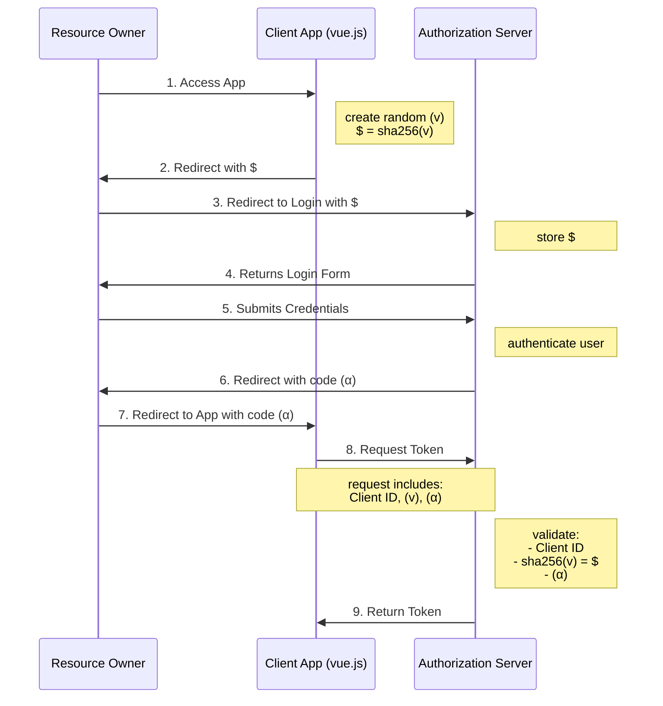

## PKCE Command Line 

This tool demonstrates the Authorization Code Flow with PKCE for IBM Cloud Identity

It follows these steps:

1. Creates a random string called the `code verifier`
2. Hashes the `code verifier` creating a value called the `code challenge`
3. Builds an authorization URL which includes:
    a. OIDC Client ID
    b. a list of request scopes
    c. a redirect uri
    d. a randomly generated state value
    e. the `code challenge`
    f. a response type set to `code` to indicate that we're using the authorization code flow
4. Launches a browser with the authorization URL, at which point you will authenticate
5. Receives the redirect from the authorization url, which includes a `code`
6. Calls the `token` endpoint with:
    a. grant type set to `authorization code`
    b. a redirect uri that must match the one used in the authorization step
    c. Okta OIDC Client ID
    d. the `code`
    e. the `code verifier` from earlier
7. Displays the tokens returned from the `token` endpoint
8. Uses the returned access token to call the `userinfo` endpoint

## Setup IBM Cloud Identity


## Usage

```
Usage: pkce-cli [options]

Options:
  -c, --client_id <client id>                    OIDC Client ID (default: "")
  -o, --tenant_url <tenant url>                  ex: https://<yourtenant>.ice.ibmcloud.com (default: "")
  -s, --scopes <space separated list of scopes>  Space separated list of scopes (default: "")
  -r, --redirect_uri <redirect uri>              redirect uri (default: "")
  -h, --help                                     output usage information
```

## Run

```
npm install
./pkce-cli \
  --client_id 0oahdifc72URh7rUV0h7 \
  --okta_org https://<yourtenant>.ice.ibmcloud.com \
  --scopes "openid profile email" \
  --redirect_uri http://localhost:8080/redirect 
```

You'll get output like this:

```
Created Code Verifier (v): a877_bdfa_acb5_a371_dc5c_c973_eed3_bfae_f7a3_a50b_0346

Created Code Challenge ($): rDspf0_iRhJ0qbiRC8TqxFWqWUtzv7-sYPD95CfF244

About to call Authorize URL: https://<yourtenant>.ice.ibmcloud.com/oidc/endpoint/default/authorize?client_id=4e0af8a0-10b7-4031-9405-3e23d981da78&response_type=code&scope=openid profile email&redirect_uri=https://localhost:8080/redirect&state=b641_48e8_9c91_6d7f_69ad_0836_0201_5466_9553_e67e_dc9a&code_challenge_method=S256&code_challenge=rDspf0_iRhJ0qbiRC8TqxFWqWUtzv7-sYPD95CfF244

press any key to continue...

Got code (α): 9SSxIje8SsirzAV1GdwTfJZtsIKHJi

press any key to continue...

Calling /token endpoint with:
client_id: 4e0af8a0-10b7-4031-9405-3e23d981da78
code_verifier (v): a877_bdfa_acb5_a371_dc5c_c973_eed3_bfae_f7a3_a50b_0346
code (α): 9SSxIje8SsirzAV1GdwTfJZtsIKHJi

Here is the complete form post that will be sent to the /token endpoint:
{
  grant_type: 'authorization_code',
  redirect_uri: 'https://localhost:8080/redirect',
  client_id: '4e0af8a0-10b7-4031-9405-3e23d981da78',
  code: '9SSxIje8SsirzAV1GdwTfJZtsIKHJi',
  code_verifier: 'a877_bdfa_acb5_a371_dc5c_c973_eed3_bfae_f7a3_a50b_0346'
}

press any key to continue...

Got token response:
{
  access_token: 'w49efjWN8DcRXqSmpiljv3BizEiOVFXgqieO0I45',
  scope: 'openid profile email',
  grant_id: '02b1919e-7ca4-472c-9ada-acca7b4647b1',
  id_token: 'eyJhbGciOiJSUzI1NiIsInR5cCI6IkpXVCIsImtpZCI6InNlcnZlciJ9.eyJnaXZlbl9uYW1lIjoiSm9vcCIsInNfaGFzaCI6IjU2RXloQTBpQ1doTjlfWmtsa1VQNnciLCJ1bmlxdWVTZWN1cml0eU5hbWUiOiI2NDAwMDUzWVpKIiwicmVhbG1OYW1lIjoiY2xvdWRJZGVudGl0eVJlYWxtIiwiZW1haWxfdmVyaWZpZWQiOnRydWUsInByZWZlcnJlZF91c2VybmFtZSI6Impvb3BAcG9jLmljZS5pYm1jbG91ZC5jb20iLCJuYW1lIjoiSm9vcCBEZW1vIiwiZW1haWwiOiJqb29wQGxvY2FsLWV2ZW50cy5ubCIsImFjciI6InVybjppYm06c2VjdXJpdHk6cG9saWN5OmlkOjEiLCJ1c2VyVHlwZSI6InJlZ3VsYXIiLCJkaXNwbGF5TmFtZSI6Ikpvb3AgRGVtbyIsImZhbWlseV9uYW1lIjoiRGVtbyIsImF0X2hhc2giOiJFTmQyZlg2Y1FRYWVaREptd01abXFnIiwiZXh0Ijp7InRlbmFudElkIjoicG9jLmljZS5pYm1jbG91ZC5jb20ifSwiaXNzIjoiaHR0cHM6Ly9wb2MuaWNlLmlibWNsb3VkLmNvbS9vaWRjL2VuZHBvaW50L2RlZmF1bHQiLCJhdWQiOiI0ZTBhZjhhMC0xMGI3LTQwMzEtOTQwNS0zZTIzZDk4MWRhNzgiLCJzdWIiOiI2NDAwMDUzWVpKIiwiaWF0IjoxNTc4OTI2NzgwLCJleHAiOjE1Nzg5MzM5ODB9.gkBhtr5RY6BtVrl7qfimLPKDmCxvIHWykVeAUfx3zGUj-ytXC4-0GK36nChybS-aGzkrQj1ye6H-RzSoTK__8Y7pYVaxrbshfjxOvagNTLGJ_lfujKmd7SHG4lTCAcht7RTCyxvg56Lxwg3qDKZm2dTo43EaaYUmImUcYTL8wkVyw1IUTL0dTEtYNjl1wxSB5pMJAsCa203WLkDgLVB-hgQ4ZF3f6Ehx2lId15Pzw2l8ViGKP0QJctCbsergbV8T0xCIOzoIS2V7CNnQ98G41e1R_OMsfD5ZErLCZsY0rHbiKsIMKexH2rW9sXGt14MS-z4ItfMQrymqVbyr4bAtgg',
  token_type: 'Bearer',
  expires_in: 7199
}

press any key to continue...

Calling /userinfo endpoint with access token

{
  ext: { tenantId: '<yourtenant>.ice.ibmcloud.com' },
  sub: '64000',
  email_verified: true,
  displayName: 'Joop',
  realmName: 'cloudIdentityRealm',
  uniqueSecurityName: '64000',
  preferred_username: 'joop@<yourtenant>.ice.ibmcloud.com',
  given_name: 'Joop',
  acr: 'urn:ibm:security:policy:id:1',
  name: 'Joop Demo',
  userType: 'regular',
  family_name: 'Demo',
  email: 'joop@'
}
```


## Diagrams

Here's an overview of the Authorization Code with PKCE flow:



